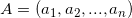

### 2.1-3
Consider the searching problem:

__Input__: A sequence of n numbers  and a value ``v``.

__Output__: An index ``i`` such that`` v = A[i] ``or the special value ``NIL`` if ``v`` does not
appear in A.

Write pseudocode for _**linear search**_, which scans through the sequence, looking
for ``v``. Using a loop invariant, prove that your algorithm is correct. Make sure that
your loop invariant fulfills the three necessary properties.

``` 
While i = 0,  i < A. lenth
    return index if A[i] == v
end

return nil

```